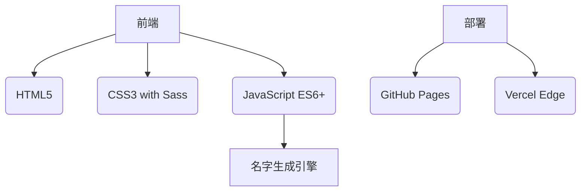

# 🧝♀️ 精灵名生成器 | Elf Name Generator

一个为奇幻爱好者打造的精灵名生成网站，为您的角色扮演游戏、小说创作或游戏角色提供独特命名灵感。

## ✨ 核心功能

### 🎲 随机名称生成
- 一键生成独特的精灵名字
- 支持多种生成算法（古典/现代/混合风格）

### 🌳 种族分类系统
| 种族类型       | 示例名字          | 特色描述          |
|----------------|-------------------|-------------------|
| 森林精灵       | Lirendel, Faelivrin | 自然亲和型名字    |
| 暗夜精灵       | Nurvaryn, Drizzt  | 神秘幽暗风格      |
| 高等精灵       | Galadriel, Elrond  | 优雅高贵型命名    |

## 🛠 技术架构



## 🏗️ 项目结构

```
elf-name-generator/
├── index.html            # 主入口文件
├── styles/
│   ├── style.css         # 主要样式
├── scripts/
│   ├── script.js         # 主逻辑
│   └── name-generator.js # 核心算法
```

## 🚀 快速开始

```bash
# 1. 克隆仓库
git clone https://github.com/jiannachen/Elf.git && cd Elf

# 2. 启动开发服务器（需安装Live Server）
npx live-server --port=3000
```

或直接访问：[在线演示](https://elfnamegenerator.online) 🔗

## 💻 开发指南

### 基础命令
```bash
# 安装依赖（如需）
npm install

# 代码格式化
npx prettier --write .
```

### 分支规范
- `main` - 生产分支
- `dev` - 开发主分支
- `feature/*` - 功能开发分支
- `hotfix/*` - 紧急修复分支

## 🤝 贡献方式

1. 提交Issue报告问题或建议
2. Fork后提交Pull Request
3. 参与文档翻译工作
4. 分享您的命名创意

## 📜 许可证

MIT License © 2025
```